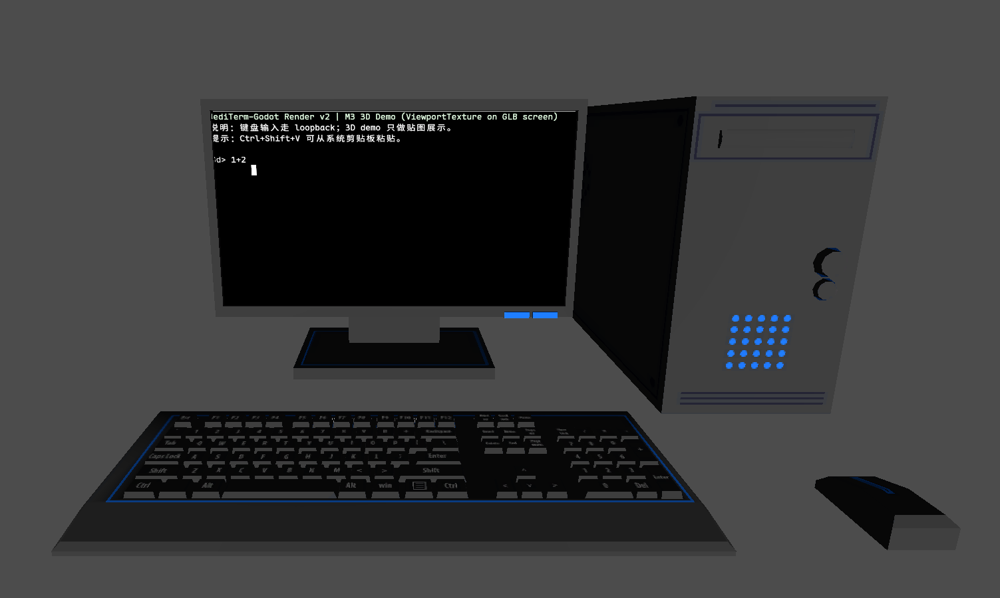
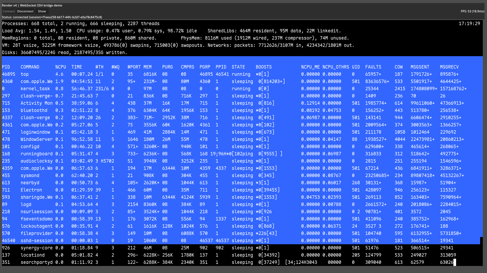

# JediTerm-Godot

[English README](README.md)

面向 Godot 4.6 的终端仿真器项目，核心用纯 GDScript 实现；终端仿真逻辑从 JediTerm（Java）移植而来。在 Windows 上可选通过 ConPTY（GDExtension）接入真实 PTY。

## 截图





## 当前状态

- Web 版已打通（Web 导出 + WS SSH bridge），可稳定连接远程机器。
- 浏览器内 IME 已可用（通过 HTML/JS IME patch 规避 Godot Web canvas 的输入法限制）。
- Demo UI 已提供 FPS 显示；本地测试 FPS 稳定 50+，并做过 24h 压测（`top` 观察）保持稳定。

## Web Demo（WS SSH bridge）

1) 启动 Python WS SSH bridge：

```powershell
cd ssh-bridge
uv run python -m uvicorn bridge.app:app --host 127.0.0.1 --port 8765 --log-level info
```

2) 本地起一个静态服务器，打开导出的 Web 页面：

```powershell
cd ..
python server.py 8080
```

然后打开：`http://localhost:8080/web/JediTerm-Godot.html`

3) 在 demo 场景中填写 SSH 目标并连接。

## 一键导出 Web（含 IME 补丁）

Web 导出产物位于 `web/`（仓库内跟踪），一键重建：

```powershell
pwsh -NoProfile -File scripts\export_web_with_ime.ps1
```

## 仓库结构

- 核心实现：`addons/jediterm/`
- Windows ConPTY（GDExtension）：`addons/jediterm/native/` + `addons/jediterm/native/conpty.gdextension`
- WS SSH bridge（Python）：`ssh-bridge/`
- 测试运行脚本（Windows/PowerShell）：`scripts/run_godot_tests.ps1`
- Headless 测试：`tests/**/test_*.gd`
- 示例场景：`scenes/`（例如 `scenes/render_v3_conpty_demo.tscn`）
- Web 导出产物：`web/`
- 设计/PRD/计划：`init.md`、`docs/prd/`、`docs/plan/`
- Agent 规约：`AGENTS.md`

## 快速开始（Windows + PowerShell）

建议先跑一个单测：

```powershell
$env:GODOT_WIN_EXE="E:\Godot_v4.6-stable_win64.exe\Godot_v4.6-stable_win64_console.exe"
$env:GODOT_TEST_TIMEOUT_SEC="120"
scripts\run_godot_tests.ps1 -One tests\addons\jediterm\test_array_terminal_data_stream.gd
```

跑 suite：

```powershell
scripts\run_godot_tests.ps1 -Suite jediterm
scripts\run_godot_tests.ps1 -Suite all
```

如果需要编译/重编 Windows ConPTY GDExtension（DLL 缺失或需要更新）：

```powershell
pwsh -NoProfile -File scripts\probe_msvc.ps1
pwsh -NoProfile -File scripts\setup_godot_cpp.ps1
pwsh -NoProfile -File scripts\build_conpty_gdextension.ps1
```

## 备注

- `refs/` 下是参考仓库，只用于对照阅读，不应把代码直接搬进主实现。
- 不要手改 Godot 的 `.uid` 文件；需要时打开 Godot 编辑器让其自动生成/修复。
